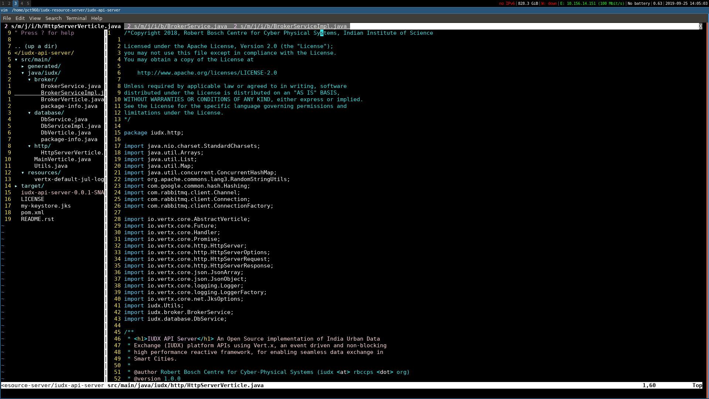

VIM-IDE: Freedom from slow and buggy IDEs
*****************************************

|license|

.. |license| image:: https://img.shields.io/badge/license-ISC-blue.svg
    :target: https://github.com/pct960/vim_config/blob/master/LICENSE

At some point or the other, we have all sworn at our IDEs for being painfully slow, buggy or both. Here's ``vim`` to the rescue. This is a simple and non-intrusive vim config that can replace your IDE to some extent. It is simple because there are not too many bells and whistles. It is non-intrusive because it does not assume any conveniences on your behalf (i.e not a lot of customisations and re-mappings)

Installation
============

* Clone the repository and run the install script::

     git clone https://github.com/pct960/vim-ide && cd vim-ide
     ./install

Features
========
Apart from the features the vanilla vim configuration provides (line numbers, relative line numbers, smart indent etc.), 
the config has been extended to add a few more features.

#. Nerdtree is automatically loaded when vim is opened
#. Opening a file places the focus on the file instead of on the nerdtree pane
#. Closing a file closes both the file and the nerdtree pane (provided no other tabs are open)
#. To open a file in a new tab, press ``t`` and to open it in split mode press ``s`` (This is a nerdtree feature, but do read further)
#. Now, to easily switch between tabs use ``Ctrl ←`` and ``Ctrl →`` (Mission control shortcuts will need to be disabled for this work on macOS)
#. Terminal can be opened from inside ``vim`` using ``,<space>``. This brings up the fish terminal, if present, or brings up bash

Why isn't autocomplete available?
=================================

Autocomplete was deliberately not added since adding language servers and a lot of plugins would have severely slowed it down. The objective of this project was to have a fast, simple and clean alternative to a bulky IDE. Adding features that make it slow would be counterproductive. That being said, features that do not compromise the smooth experience of ``vim`` can always be added.

Contributions
=============
Feel free to open a pull request, raise an issue or a feature request.

Credits
=======
 `amix <https://github.com/amix/vimrc>`_ for plugin ideas and `rraks <https://github.com/rraks/configs>`_ for the vanilla vim configuration
